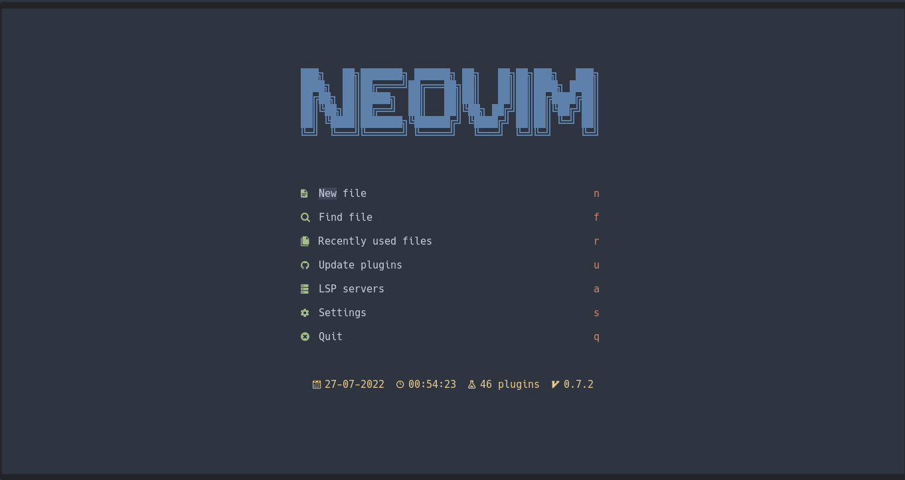
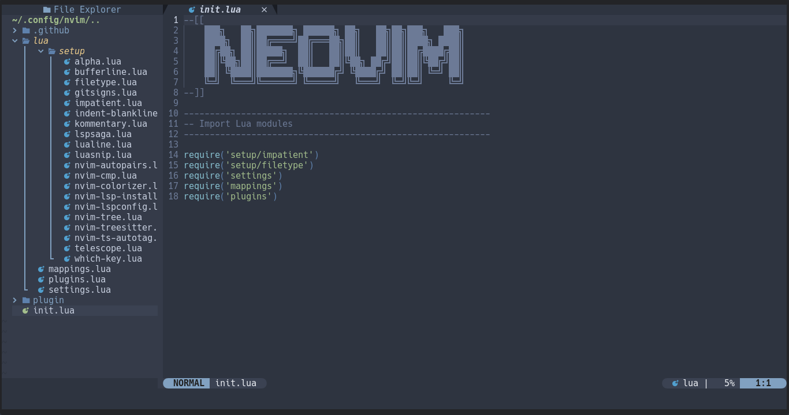
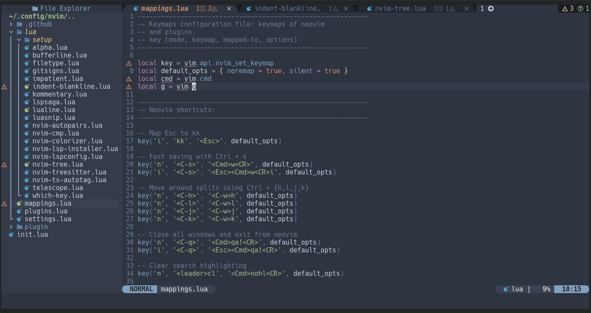
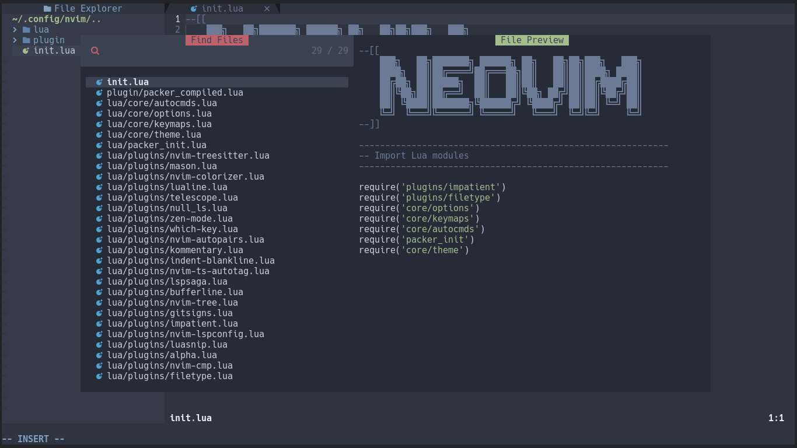
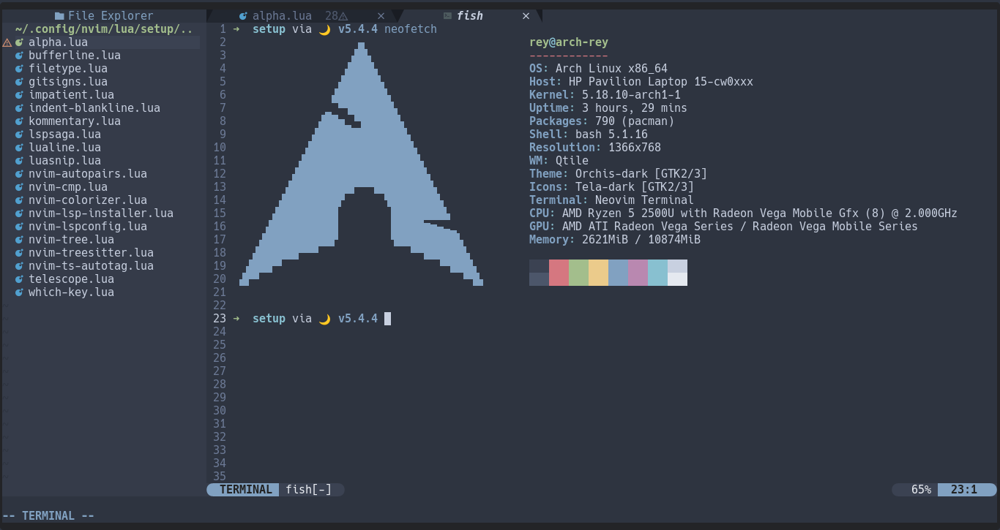

<p align="center">
    
</p>

---

<h2>Configuration structure (Lua)</h2>

```text
📂 ~/.config/nvim
├── 📂 lua
│   ├── 📂 core
│   │   ├── 🌑 autocmds.lua
│   │   ├── 🌑 keymaps.lua
│   │   ├── 🌑 theme.lua
│   │   └── 🌑 options.lua
│   ├── 📂 plugins
│   │   ├── 🌑 alpha.lua
│   │   ├── 🌑 bufferline.lua
│   │   ├── 🌑 conform.lua
│   │   ├── 🌑 gitsigns.lua
│   │   ├── 🌑 impatient.lua
│   │   ├── 🌑 indent-blankline.lua
│   │   ├── 🌑 kommentary.lua
│   │   ├── 🌑 lspsaga.lua
│   │   ├── 🌑 lualine.lua
│   │   ├── 🌑 luasnip.lua
│   │   ├── 🌑 mason.lua
│   │   ├── 🌑 null_ls.lua
│   │   ├── 🌑 nvim-autopairs.lua
│   │   ├── 🌑 nvim-cmp.lua
│   │   ├── 🌑 nvim-colorizer.lua
│   │   ├── 🌑 nvim-lspconfig.lua
│   │   ├── 🌑 nvim-tree.lua
│   │   ├── 🌑 nvim-treesitter.lua
│   │   ├── 🌑 nvim-ts-autotag.lua
│   │   ├── 🌑 telescope.lua
│   │   ├── 🌑 which-key.lua
│   │   └── 🌑 zen-mode.lua
│   └── 🌑 packer_init.lua
└── 🌑 init.lua
```

---

<h2>Plugins</h2>

<table>
    <tr>
        <th>Plugin Manager</th>
        <td>
            <a href="https://github.com/wbthomason/packer.nvim">packer</a>
        </td>
    </tr>
    <tr>
        <th>Startup</th>
        <td>
            <a href="https://github.com/goolord/alpha-nvim">alpha-nvim</a>
        </td>
    </tr>
    <tr>
        <th>Statusline</th>
        <td>
            <a href="https://github.com/nvim-lualine/lualine.nvim">lualine</a>
        </td>
    </tr>
    <tr>
        <th>Icons</th>
        <td>
            <a href="https://github.com/kyazdani42/nvim-web-devicons">nvim-web-devicons</a>
        </td>
    </tr>
    <th>Colors</th>
        <td>
            <a href="https://github.com/norcalli/nvim-colorizer.lua">nvim-colorizer</a>
        </td>
    </tr>
    <tr>
        <th>Indent</th>
        <td>
            <a href="https://github.com/lukas-reineke/indent-blankline.nvim">indent-blankline</a>
        </td>
    </tr>
    <tr>
        <th>Comments</th>
        <td>
            <a href="https://github.com/b3nj5m1n/kommentary">kommentary</a>
        </td>
    </tr>
    <tr>
        <th>Formatter</th>
        <td>
            <a href="https://github.com/stevearc/conform.nvim">conform.nvim</a><br>
            <a href="https://github.com/rcarriga/nvim-notify">nvim-notify</a>
        </td>
    </tr>
    <tr>
        <th>Markdown</th>
        <td>
            <a href="https://github.com/iamcco/markdown-preview.nvim">markdown-preview.nvim</a>
        </td>
    </tr>
    <tr>
        <th>File explorer</th>
        <td>
            <a href="https://github.com/kyazdani42/nvim-tree.lua">nvim-tree</a>
        </td>
    </tr>
    <tr>
        <th>Tabline</th>
        <td>
            <a href="https://github.com/akinsho/bufferline.nvim">bufferline</a><br>
            <a href="https://github.com/ojroques/nvim-bufdel">nvim-bufdel</a>
        </td>
    </tr>
    <tr>
        <th>Colorscheme</th>
        <td>
            <a href="https://github.com/rmehri01/onenord.nvim">onenord (default)</a><br>
            <a href="https://github.com/folke/tokyonight.nvim">tokyonight</a><br>
            <a href="https://github.com/olimorris/onedarkpro.nvim">onedarkpro</a>
        </td>
    </tr>
    <tr>
        <th>Fuzzy Finder</th>
        <td>
            <a href="https://github.com/nvim-telescope/telescope.nvim">telescope</a><br>
            <a href="https://github.com/nvim-telescope/telescope-fzf-native.nvim">telescope-fzf-native</a><br>
            <a href="https://github.com/nvim-telescope/telescope-ui-select.nvim">telescope-ui-select</a>
        </td>
    </tr>
    <tr>
        <th>LSP</th>
        <td>
            <a href="https://github.com/neovim/nvim-lspconfig">nvim-lspconfig</a> <br>
            <a href="https://github.com/glepnir/lspsaga.nvim">lspsaga</a> <br>
            <a href="https://github.com/williamboman/mason">mason</a> <br>
            <a href="https://github.com/williamboman/mason-lspconfig.nvim">mason-lspconfig</a>
        </td>
    </tr>
    <tr>
        <th>Syntax</th>
        <td>
            <a href="https://github.com/nvim-treesitter/nvim-treesitter">nvim-treesitter</a>
        </td>
    </tr>
    <tr>
        <th>Snippet</th>
        <td>
            <a href="https://github.com/L3MON4D3/LuaSnip">luasnip</a> <br>
            <a href="https://github.com/rafamadriz/friendly-snippets">friendly-snippets</a>
        </td>
    </tr>
    <tr>
        <th>Git</th>
        <td>
            <a href="https://github.com/lewis6991/gitsigns.nvim">gitsigns</a> <br>
        </td>
    </tr>
    <tr>
        <th>Completion</th>
        <td>
            <a href="https://github.com/hrsh7th/nvim-cmp">nvim-cmp</a> <br>
            <a href="https://github.com/hrsh7th/cmp-nvim-lsp">cmp-nvim-lsp</a> <br>
            <a href="https://github.com/hrsh7th/cmp-path">cmp-path</a><br>
            <a href="https://github.com/hrsh7th/cmp-buffer">cmp-buffer</a> <br>
            <a href="https://github.com/hrsh7th/cmp-nvim-lua">cmp-nvim-lua</a> <br>
            <a href="https://github.com/hrsh7th/cmp-cmdline">cmp-cmdline</a> <br>
            <a href="https://github.com/saadparwaiz1/cmp_luasnip">cmp-luasnip</a> <br>
            <a href="https://github.com/David-Kunz/cmp-npm">cmp-npm</a> <br>
            <a href="https://github.com/lukas-reineke/cmp-under-comparator">cmp-under-comparator</a> <br>
            <a href="https://github.com/onsails/lspkind.nvim">lspkind.nvim</a>
        </td>
    </tr>
    <tr>
        <th>Editing Support</th>
        <td>
            <a href="https://github.com/windwp/nvim-autopairs">nvim-autopairs</a> <br>
            <a href="https://github.com/windwp/nvim-ts-autotag">nvim-ts-autotags</a> <br>
            <a href="https://github.com/andymass/vim-matchup">vim-matchup</a> <br>
            <a href="https://github.com/kylechui/nvim-surround">nvim-surround</a> <br>
            <a href="https://github.com/folke/which-key.nvim">which-key</a> <br>
            <a href="https://github.com/folke/zen-mode.nvim">zen-mode</a> <br>
            <a href="https://github.com/folke/twilight.nvim">twilight</a> <br>
        </td>
    </tr>
    <tr>
        <th>Performance</th>
        <td>
            <a href="https://github.com/lewis6991/impatient.nvim">impatient.nvim</a> <br>
        </td>
    </tr>
 </table>

---

<h2>Neovim screenshots</h2>

<h3>Startup (alpha-nvim)</h3>
<p align="center">
    
</p>

<h3>File Explorer (nvim-tree)</h3>
<p align="center">
    
</p>

<h3>LSP Diagnostics (nvim-lspconfig)</h3>
<p align="center">
    
</p>

<h3>Fuzzy Finder (telescope)</h3>
<p align="center">
    
</p>

<h3>Terminal (native)</h3>
<p align="center">
    
</p>

<h3>Help with keybindings (which-key)</h3>
<p align="center">
    
</p>
