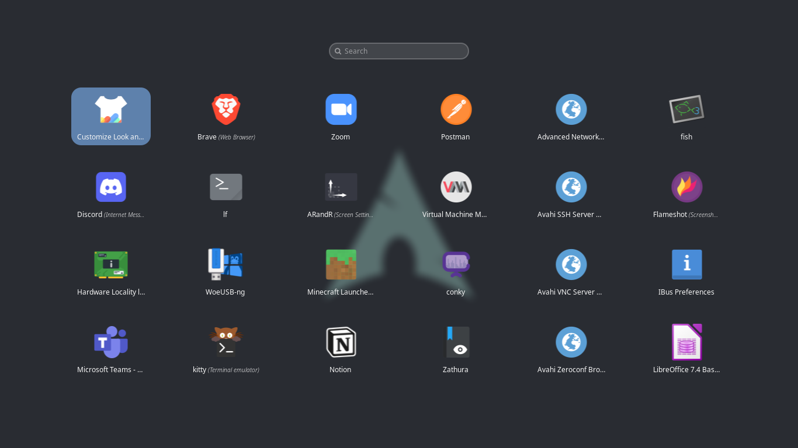
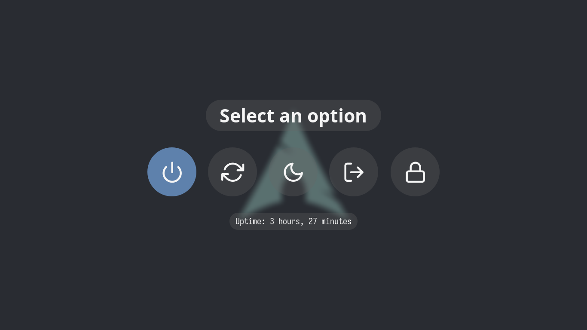

# dotfiles

## Desktop


---

## Neovim

### [Configuration](https://github.com/ReyVega/dotfiles/tree/main/.config/nvim)


---

## Rofi

### Menu



### Minimize/Unminimize windows


### Powermenu



---

## Software Details

| Software              | Utility                                                                                             |
| --------------------- | --------------------------------------------------------------------------------------------------- |
| Operating Systems     | [arch-linux](https://wiki.archlinux.org/)                                                           |
| AUR Helper            | [paru](https://github.com/Morganamilo/paru)                                                         |
| Boot Loader           | [grub](https://wiki.archlinux.org/title/GRUB#Installation)                                          |
| Window Manager        | [qtile](http://www.qtile.org/)                                                                      |
| Display Manager       | [sddm](https://wiki.archlinux.org/title/SDDM)                                                       |
| Screen Locker         | [betterlockscreen](https://github.com/betterlockscreen/betterlockscreen)                            |
| Shell                 | bash using [starship](https://starship.rs/) and [fish](https://fishshell.com/)                      |
| Terminal              | [kitty](https://github.com/kovidgoyal/kitty)                                                        |
| Compositor            | [picom](https://wiki.archlinux.org/title/Picom)                                                     |
| Notification Daemon   | [dunst](https://dunst-project.org/)                                                                 |
| Application Launcher  | [rofi](https://github.com/davatorium/rofi)                                                          |
| File Manager          | [lf](https://github.com/gokcehan/lf)                                                                |
| Screenshots           | [flameshot](https://github.com/flameshot-org/flameshot)                                             |
| GTK Settings          | [lxappearance-gtk3](https://archlinux.org/packages/community/x86_64/lxappearance-gtk3/)             |
| CLI Images Viewer     | [feh](https://archlinux.org/packages/extra/x86_64/feh/)                                             |
| Editor                | [neovim](https://neovim.io/)                                                                        |
| Screen brightness     | [brightnessctl](https://archlinux.org/packages/community/x86_64/brightnessctl/)                     |
| Audio                 | [pipewire](https://archlinux.org/packages/extra/x86_64/pipewire/)                                   |
| Audio Pulse           | [pipewire-pulse](https://archlinux.org/packages/extra/x86_64/pipewire-pulse/)                       |
| Audio Jack            | [pipewire-jack](https://archlinux.org/packages/?name=pipewire-jack)                                 |
| Audio Alsa            | [pipewire-alsa](https://archlinux.org/packages/extra/x86_64/pipewire-alsa/)                         |
| Audio Session Manager | [wireplumber](https://archlinux.org/packages/extra/x86_64/wireplumber/)                             |
| Audio Manager         | [pulsemixer](https://archlinux.org/packages/community/any/pulsemixer/)                              |
| Video Manager         | [mpv](https://archlinux.org/packages/community/x86_64/mpv/)                                         |
| Network Manager       | [networkmanager (nmcli/nm-applet)](https://wiki.archlinux.org/title/NetworkManager)                 |
| Firewall              | [uncomplicated firewall](https://wiki.archlinux.org/title/Uncomplicated_Firewall)                   |
| Music Player          | [ncmpcpp](https://github.com/ncmpcpp/ncmpcpp) using [mpd](https://github.com/MusicPlayerDaemon/MPD) |

---

## Extras

### VPN

| Software   | Utility                                                 |
| ---------- | ------------------------------------------------------- |
| VPN        | [ProtonVPN](https://wiki.archlinux.org/title/ProtonVPN) |
| VPN Client | [protonvpn-cli](https://github.com/ProtonVPN/linux-cli) |

### Virtual Machines

| Software        | Utility                                                                    |
| --------------- | -------------------------------------------------------------------------- |
| Manager         | [virt-manager](https://archlinux.org/packages/community/any/virt-manager/) |
| Hypervisor      | [qemu](https://archlinux.org/packages/extra/x86_64/qemu/)                  |
| NAT/DHCP Guests | [dnsmasq](https://archlinux.org/packages/extra/x86_64/dnsmasq/)            |
| NAT Networking  | [iptables-nft](https://archlinux.org/packages/?name=iptables-nft)          |
| UEFI Support    | [edk2-ovmf](https://archlinux.org/packages/extra/any/edk2-ovmf/)           |

---

## Fonts and Theming

| Software     | Utility                                                                |
| ------------ | ---------------------------------------------------------------------- |
| GTK Theme    | [Orchis-dark](https://www.gnome-look.org/p/1357889/)                   |
| GTK Icons    | [Tela-dark](https://www.pling.com/p/1279924/)                          |
| GTK Mouse    | [Bibata Modern Ice](https://www.bibata.live/studio)                    |
| GTK Grub     | [Tela](https://www.gnome-look.org/p/1307852)                           |
| SDDM Theme   | [Sugar Candy](https://aur.archlinux.org/packages/sddm-sugar-candy-git) |
| Font         | [Hack Nerd Font](https://www.nerdfonts.com/)                           |
| System Theme | [Nord](https://www.nordtheme.com/)                                     |

---

## Installation

```
bash -c "$(curl https://raw.githubusercontent.com/ReyVega/dotfiles/main/.github/install)"
```

## Packages installation

### Main

```
bash -c "$(curl https://raw.githubusercontent.com/ReyVega/dotfiles/main/.github/repos/scripts/main)"
```

## Xorg Drivers

### Intel

```
bash -c "$(curl https://raw.githubusercontent.com/ReyVega/dotfiles/main/.github/repos/scripts/intel)"
```

### AMD

```
bash -c "$(curl https://raw.githubusercontent.com/ReyVega/dotfiles/main/.github/repos/scripts/amd)"
```

### Nvidia

```
bash -c "$(curl https://raw.githubusercontent.com/ReyVega/dotfiles/main/.github/repos/scripts/nvidia)"
```

## Paru

### Installation

```
bash -c "$(curl https://raw.githubusercontent.com/ReyVega/dotfiles/main/.github/repos/scripts/paru_install)"
```

### AUR Packages

```
bash -c "$(curl https://raw.githubusercontent.com/ReyVega/dotfiles/main/.github/repos/scripts/aur)"
```
