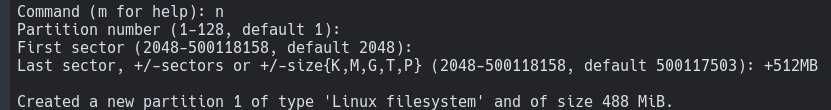

# Installation guide

## 1st Step

Connect to internet either using ethernet or wifi (iwd)

### Commands to connect via wifi

Enter iwd prompt

```
iwctl
```

Find your wifi device

```
device list
```

Scan all networks nearby

```
station <device> scan
```

List all available networks nearby

```
station <device> get-networks
```

Connect to desired network

```
station <device> connect <SSID>
exit
```

**Note:** if network has a password you'll be prompted a field to enter it

[More details - iwd](https://wiki.archlinux.org/title/iwd)

## 2nd Step
Create and mount OS points

### Using fdisk
Identify your disks
```
fdisk -l
```

Enter fdisk prompt by selecting your desired disk to format
```
fdisk /dev/<disk>
```

Create a new GPT Table
```
Command (m for help): g
```

Create partitions
- EFI



