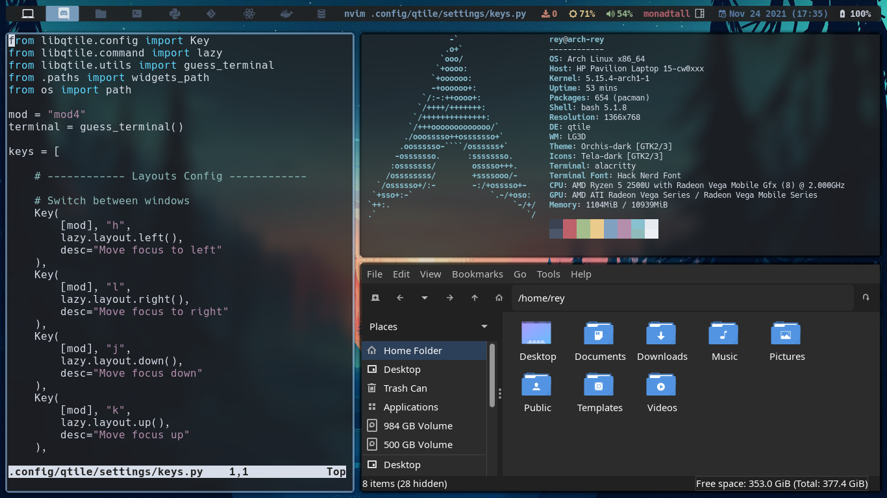

# dotfiles
</img>

---
<h2>Software Details</h2>

<table>
    <tr>
        <th>Operating System</th>
        <td>Arch Linux</td>
    </tr>
    <tr>
        <th>AUR Helper</th>
        <td>Paru</td>
    </tr>
    <tr>
        <th>Boot Loader</th>
        <td>Grub</td>
    </tr>
    <tr>
        <th>Window Manager</th>
        <td>Qtile</td>
    </tr>
    <tr>
        <th>Display Manager</th>
        <td>LightDM</td>
    </tr>
    <tr>
        <th>LightDM Greeter</th>
        <td>lightdm-webkit2-greeter</td>
    </tr>
    <tr>
        <th>Screen Locker</th>
        <td>light-locker</td>
    </tr>
    <tr>
        <th>Shell</th>
        <td>Bash using Starship and Fish</td>
    </tr>
    <tr>
        <th>Terminal</th>
        <td>Alacritty</td>
    </tr>
    <tr>
        <th>Compositor</th>
        <td>Picom-git</td>
    </tr>
    <tr>
        <th>Notification Daemon</th>
        <td>Dunst</td>
    </tr>
    <tr>
        <th>Application Launcher</th>
        <td>Rofi</td>
    </tr>
    <tr>
        <th>File Manager</th>
        <td>PCManFM</td>
    </tr>
    <tr>
        <th>Screenshots</th>
        <td>Scrot and XClip</td>
    </tr>
    <tr>
        <th>GUI for setting themes</th>
        <td>lxappearance</td>
    </tr>
    <tr>
        <th>CLI for setting wallpapers</th>
        <td>Feh</td>
    </tr>
    <tr>
        <th>Editor</th>
        <td>Neovim</td>
    </tr>
    <tr>
        <th>Laptop Screen Brightness</th>
        <td>Brightnessctl</td>
    </tr>
    <tr>
        <th>Audio</th>
        <td>Pipewire-Pulse</td>
    </tr>
    <tr>
        <th>Audio Manager</th>
        <td>Pulsemixer</td>
    </tr>
    <tr>
        <th>Video Manager</th>
        <td>MPV</td>
    </tr>
    <tr>
        <th>Network Manager</th>
        <td>networkmanager (nmcli/nmtui)</td>
    </tr>
    <tr>
        <th>Firewall</th>
        <td>Uncomplicated Firewall</td>
    </tr>
    <tr>
        <th>Virtual Machines Manager</th>
        <td>Cockpit</td>
    </tr>
</table>

---

<h2>Fonts and Theming</h2>
<table>
    <tr>
        <th>GTK Theme</th>
        <td>Orchis-dark</td>
    </tr>
    <tr>
        <th>GTK Icons</th>
        <td>Tela dark</td>
    </tr>
    <tr>
        <th>GTK Mouse</th>
        <td>Sweet-Cursors</td>
    </tr>
    <tr>
        <th>LightDM Theme</th>
        <td>Glorious</td>
    </tr>
    <tr>
        <th>Font</th>
        <td>Hack Nerd Font</td>
    </tr>
    <tr>
        <th>Almost Every System Theme</th>
        <td>Nord</td>
    </tr>
</table>
