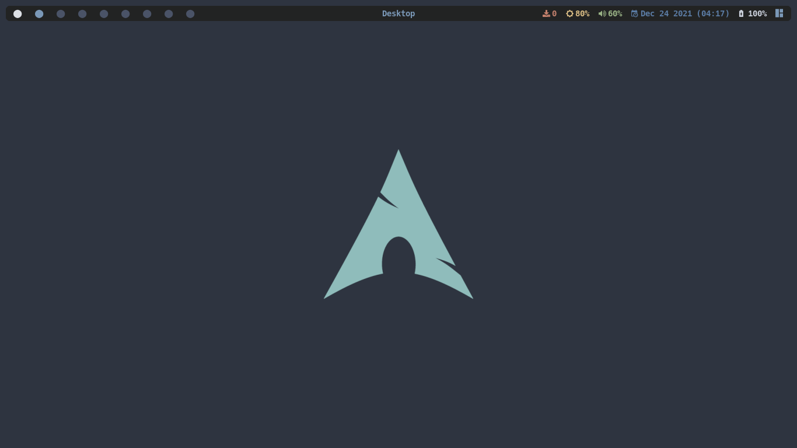
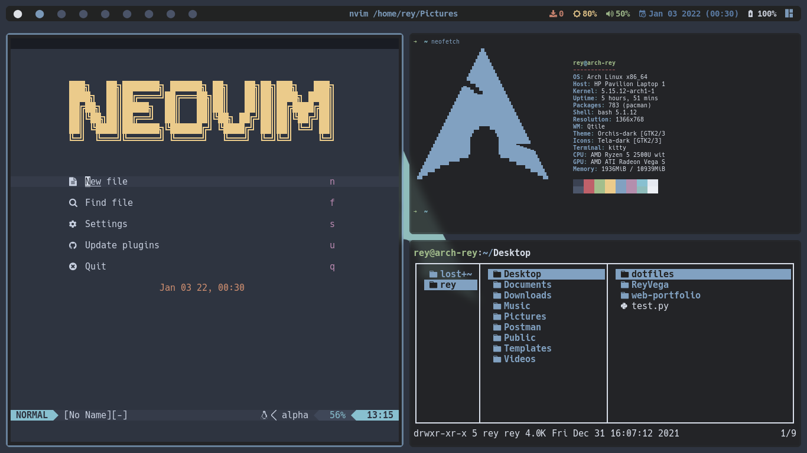
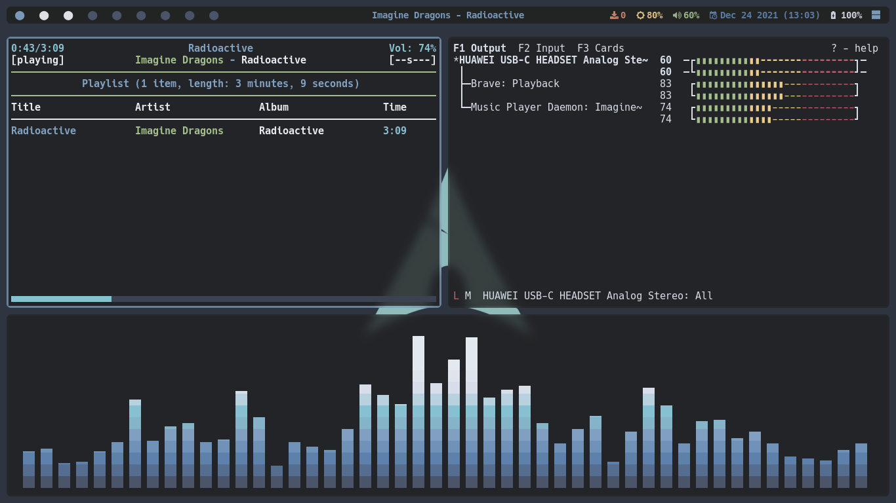
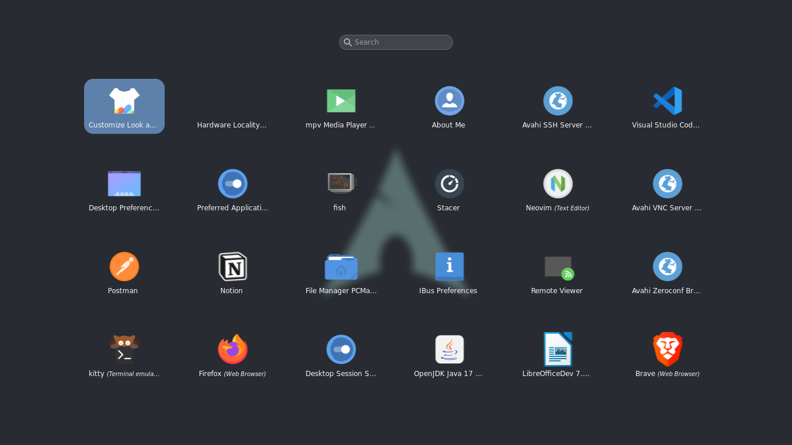
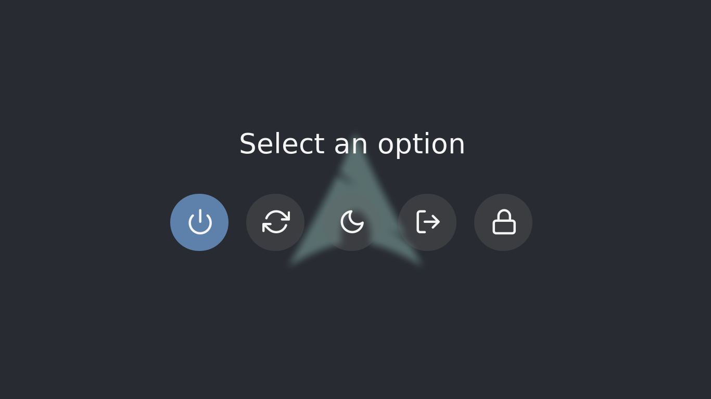

# dotfiles
<h2>Desktop</h2>

---
<h2>Neovim configuration</h2>
<h3><a href='https://github.com/ReyVega/dotfiles/tree/main/dot_config/nvim'>Neovim</a><h3>

---
<h2>Rofi</h2>
<h3>Menu</h3>

<h3>Powermenu</h3>

---
<h2>Software Details</h2>

<table>
    <tr>
        <th>Operating System</th>
        <td>
            <a href="https://wiki.archlinux.org/">arch-linux</a>
        </td>
    </tr>
    <tr>
        <th>AUR Helper</th>
        <td>
            <a href="https://github.com/Morganamilo/paru">paru</a>
        </td>
    </tr>
    <tr>
        <th>Boot Loader</th>
        <td>
            <a href="https://wiki.archlinux.org/title/GRUB#Installation">grub</a>
        </td>
    </tr>
    <tr>
        <th>Window Manager</th>
        <td>
            <a href="http://www.qtile.org/">qtile</a>
        </td>
    </tr>
    <tr>
        <th>Display Manager</th>
        <td>
            <a href="https://wiki.archlinux.org/title/LightDM">lightdm</a>
        </td>
    </tr>
    <tr>
        <th>LightDM Greeter</th>
        <td>
            <a href="https://archlinux.org/packages/community/x86_64/lightdm-webkit2-greeter/">lightdm-webkit2-greeter</a>
        </td>
    </tr>
    <tr>
        <th>Screen Locker</th>
        <td>
            <a href="https://github.com/betterlockscreen/betterlockscreen">betterlockscreen</a>
        </td>
    </tr>
    <tr>
        <th>Shell</th>
        <td>
            bash using <a href="https://starship.rs/">starship</a> and <a href="https://fishshell.com/">fish</a>
        </td>
    </tr>
    <tr>
        <th>Terminal</th>
        <td>
            <a href="https://github.com/kovidgoyal/kitty">kitty</a>
        </td>
    </tr>
    <tr>
        <th>Compositor</th>
        <td>
            <a href="https://github.com/yshui/picom">picom-git</a>
        </td>
    </tr>
    <tr>
        <th>Notification Daemon</th>
        <td>
            <a href="https://dunst-project.org/">dunst</a>
        </td>
    </tr>
    <tr>
        <th>Application Launcher</th>
        <td>
            <a href="https://github.com/davatorium/rofi">rofi</a>
        </td>
    </tr>
    <tr>
        <th>File Manager</th>
        <td>
            <a href="https://github.com/gokcehan/lf">lf</a>
            and
            <a href="https://wiki.archlinux.org/title/PCManFM">pcmanfm</a>
        </td>
    </tr>
    <tr>
        <th>Screenshots</th>
        <td>
            <a href="https://github.com/flameshot-org/flameshot">flameshot</a>
        </td>
    </tr>
    <tr>
        <th>GUI for setting themes</th>
        <td>
            <a href="https://archlinux.org/packages/community/x86_64/lxappearance/">lxappearance</a>
        </td>
    </tr>
    <tr>
        <th>CLI for viewing images</th>
        <td>
            <a href="https://archlinux.org/packages/extra/x86_64/feh/">feh</a>
        </td>
    </tr>
    <tr>
        <th>Editor</th>
        <td>
            <a href="https://neovim.io/">neovim</a>
        </td>
    </tr>
    <tr>
        <th>Laptop Screen Brightness</th>
        <td>
            <a href="https://archlinux.org/packages/community/x86_64/brightnessctl/">brightnessctl</a>
        </td>
    </tr>
    <tr>
        <th>Audio</th>
        <td>
            <a href="https://archlinux.org/packages/extra/x86_64/pipewire/">pipewire</a> 
            <a href="https://archlinux.org/packages/extra/x86_64/pipewire-alsa/">pipewire-alsa</a> 
            <a href="https://archlinux.org/packages/extra/x86_64/pipewire-pulse/">pipewire-pulse</a> 
            <a href="https://archlinux.org/packages/extra/x86_64/pipewire-jack/">pipewire-jack</a> 
            <a href="https://archlinux.org/packages/extra/x86_64/wireplumber/">wireplumber</a> 
        </td>
    </tr>
    <tr>
        <th>Audio Manager</th>
        <td>
            <a href="https://archlinux.org/packages/community/any/pulsemixer/">pulsemixer</a>
        </td>
    </tr>
    <tr>
        <th>Video Manager</th>
        <td>
            <a href="https://archlinux.org/packages/community/x86_64/mpv/">mpv</a>
        </td>
    </tr>
    <tr>
        <th>Network Manager</th>
        <td>
            <a href="https://wiki.archlinux.org/title/NetworkManager">networkmanager (nmcli/nmtui)</a>
        </td>
    </tr>
    <tr>
        <th>Firewall</th>
        <td>
            <a href="https://wiki.archlinux.org/title/Uncomplicated_Firewall">uncomplicated firewall</a>
        </td>
    </tr>
    <tr>
        <th>Music Player</th>
        <td>
            <a href="https://github.com/ncmpcpp/ncmpcpp">ncmpcpp</a>
            using
            <a href="https://github.com/MusicPlayerDaemon/MPD">mpd</a>
        </td>
    </tr>
    <tr>
        <th>Virtual Machines</th>
        <td>
            <a href="https://archlinux.org/packages/community/any/virt-manager/">virt-manager</a> (GUI Manager) 
            <a href="https://archlinux.org/packages/extra/x86_64/qemu/">qemu</a> (Hypervisor) 
            <a href="https://archlinux.org/packages/extra/x86_64/dnsmasq/">dnsmasq</a> (NAT/DHCP guests) 
            <a href="https://archlinux.org/packages/?name=iptables-nft">iptables-nft</a> (NAT networking) 
            <a href="https://archlinux.org/packages/extra/any/edk2-ovmf/">edk2-ovmf</a> (UEFI-support) 
        </td>
    </tr>
</table>

---

<h2>Fonts and Theming</h2>
<table>
    <tr>
        <th>GTK Theme</th>
        <td>
            <a href="https://www.gnome-look.org/p/1357889/">Orchis-dark</a>
        </td>
    </tr>
    <tr>
        <th>GTK Icons</th>
        <td>
            <a href="https://www.pling.com/p/1279924/">Tela dark</a>
        </td>
    </tr>
    <tr>
        <th>GTK Mouse</th>
        <td>
            <a href="https://www.gnome-look.org/p/1393084/">Sweet-Cursors</a>
        </td>
    </tr>
    <tr>
        <th>LightDM Theme</th>
        <td>
            <a href="https://github.com/manilarome/lightdm-webkit2-theme-glorious">Glorious</a>
        </td>
    </tr>
    <tr>
        <th>Font</th>
        <td>
            <a href="https://www.nerdfonts.com/">Hack Nerd Font</a>
        </td>
    </tr>
    <tr>
        <th>Almost Every System Theme</th>
        <td>
            <a href="https://www.nordtheme.com/">Nord</a>
        </td>
    </tr>
</table>

