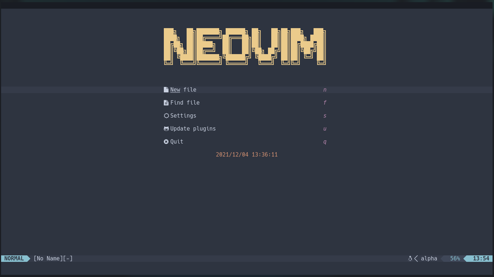
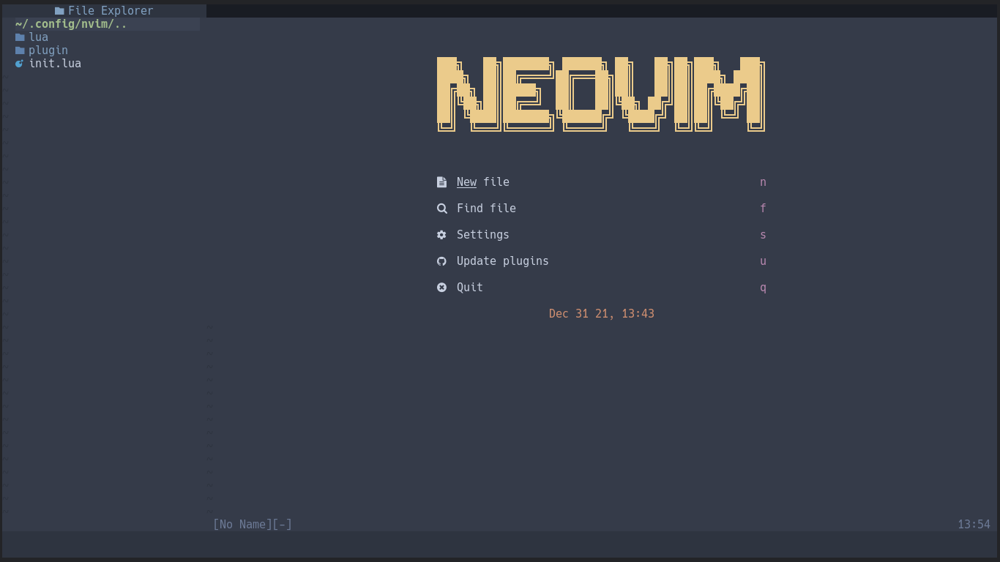
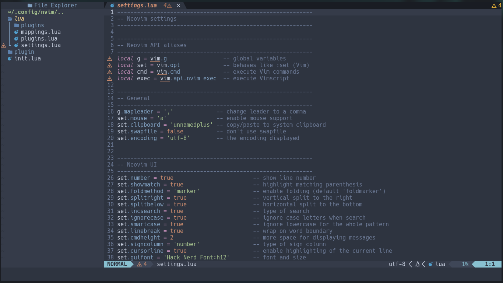
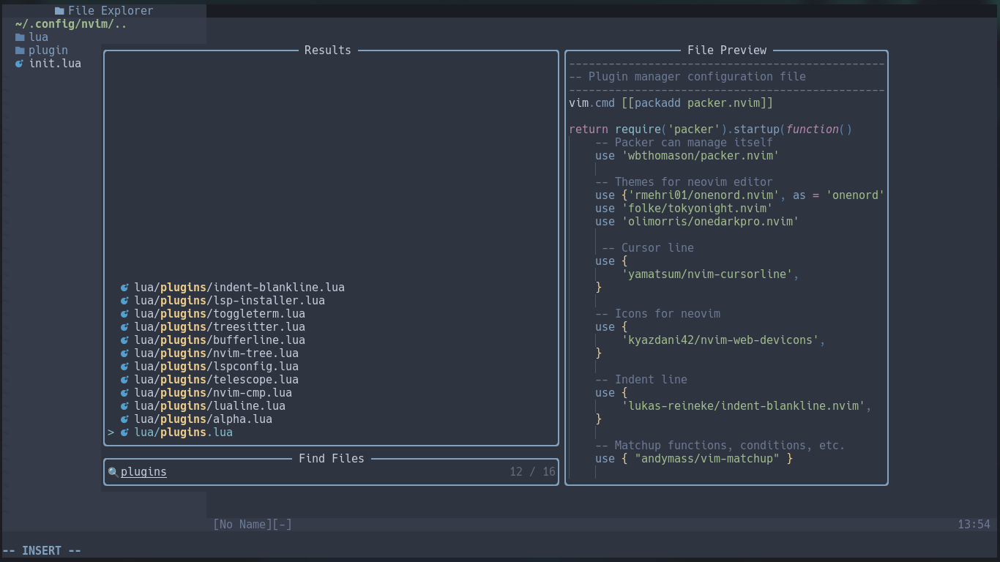
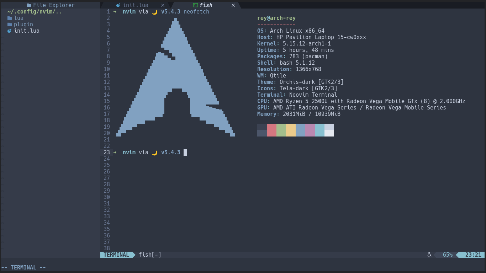

<h1>VS Neovim</h1>
</img>
</img>
</img>
</img>
</img>

---

<h2>Plugins</h2>
<table>
    <tr>
        <th>Plugin Manager</th>
        <td>packer</td>
    </tr>
    <tr>
        <th>Startup</th>
        <td>alpha-nvim</td>
    </tr>
    <tr>
        <th>Statusline</th>
        <td>lualine</td>
    </tr>
    <tr>
        <th>Icons</th>
        <td>nvim-web-devicons</td>
    </tr>
    <th>Colors</th>
        <td>nvim-colorizer</td>
    </tr>
    <tr>
        <th>Cursor</th>
        <td>nvim-cursorline</td>
    </tr>
    <tr>
        <th>Indent</th>
        <td>indent-blankline</td>
    </tr>
    <tr>
        <th>Comments</th>
        <td>kommentary</td>
    </tr>
    <tr>
        <th>Formatter</th>
        <td>neoformat</td>
    </tr>
    <tr>
        <th>Markdown</th>
        <td>nvim-markdown-preview</td>
    </tr>
    <tr>
        <th>Terminal Integration</th>
        <td>nvim-toggleterm</td>
    </tr>
    <tr>
        <th>File explorer</th>
        <td>nvim-tree</td>
    </tr>
    <tr>
        <th>Tabline</th>
        <td>
            bufferline  
            <b>Utilities</b> 
            bufdel
        </td>
    </tr>
    <tr>
        <th>Colorscheme</th>
        <td>
            onenord (default) 
            tokyonight 
            onedarkpro
        </td>
    </tr>
    <tr>
        <th>Fuzzy Finder</th>
        <td>
            telescope  
            <b>Extensions</b> 
            telescope-fzf-native
        </td>
    </tr>
    <tr>
        <th>LSP</th>
        <td>
            nvim-lspconfig  
            nvim-lsp-installer
        </td>
    </tr>
    <tr>
        <th>Syntax</th>
        <td>nvim-treesitter</td>
    </tr>
    <tr>
        <th>Snippet</th>
        <td>LuaSnip</td>
    </tr>
    <tr>
        <th>Git Gutter</th>
        <td>gitsigns</td>
    </tr>
    <tr>
        <th>Completion</th>
        <td>
            nvim-cmp   
            <b>Sources</b> 
            cmp-nvim-lsp 
            cmp-luasnip 
            cmp-path 
            cmp-git 
            cmp-buffer 
            cmp-nvim-lua 
            cmp-rg 
            cmp-spell 
            cmp-npm  
            <b>Icons</b> 
            lspkind (VS Code)
        </td>
    </tr>
    <tr>
        <th>Editing Support</th>
        <td>
            nvim-autopairs 
            nvim-ts-autotags 
            vim-matchup
        </td>
    </tr>
</table>
