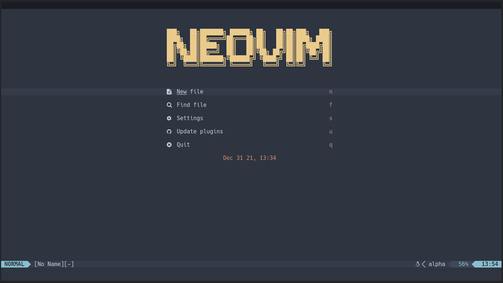

<h1>VS Neovim</h1>


---

<h2>Configuration structure (Lua)</h2>

```text
📂 ~/.config/nvim
├── 📂 lua
│   ├── 📂 plugins
│   │   ├── 🌑 alpha.lua
│   │   ├── 🌑 bufferline.lua
│   │   ├── 🌑 indent-blanklineb.lua
│   │   ├── 🌑 lsp-installer.lua
│   │   ├── 🌑 lspconfig.lua
│   │   ├── 🌑 lualine.lua
│   │   ├── 🌑 nvim-cmp.lua
│   │   ├── 🌑 nvim-tree.lua
│   │   ├── 🌑 telescope.lua
│   │   ├── 🌑 toggleterm.lua
│   │   └── 🌑 treesitter.lua
│   ├── 🌑 mappings.lua
│   ├── 🌑 plugins.lua
│   └── 🌑 settings.lua
└── 🌑 init.lua
```

---

<h2>Plugins</h2>
<table>
    <tr>
        <th>Plugin Manager</th>
        <td>
            <a href="https://github.com/wbthomason/packer.nvim">packer</a>
        </td>
    </tr>
    <tr>
        <th>Startup</th>
        <td>
            <a href="https://github.com/goolord/alpha-nvim">alpha-nvim</a>
        </td>
    </tr>
    <tr>
        <th>Statusline</th>
        <td>
            <a href="https://github.com/nvim-lualine/lualine.nvim">lualine</a>
        </td>
    </tr>
    <tr>
        <th>Icons</th>
        <td>
            <a href="https://github.com/kyazdani42/nvim-web-devicons">nvim-web-devicons</a>
        </td>
    </tr>
    <th>Colors</th>
        <td>
            <a href="https://github.com/norcalli/nvim-colorizer.lua">nvim-colorizer</a>
        </td>
    </tr>
    <tr>
        <th>Cursor</th>
        <td>
            <a href="https://github.com/yamatsum/nvim-cursorline">nvim-cursorline</a>
        </td>
    </tr>
    <tr>
        <th>Indent</th>
        <td>
            <a href="https://github.com/lukas-reineke/indent-blankline.nvim">indent-blankline</a>
        </td>
    </tr>
    <tr>
        <th>Comments</th>
        <td>
            <a href="https://github.com/b3nj5m1n/kommentary">kommentary</a>
        </td>
    </tr>
    <tr>
        <th>Formatter</th>
        <td>
            <a href="https://github.com/sbdchd/neoformat">neoformat</a>
        </td>
    </tr>
    <tr>
        <th>Markdown</th>
        <td>
            <a href="https://github.com/davidgranstrom/nvim-markdown-preview">nvim-markdown-preview</a>
        </td>
    </tr>
    <tr>
        <th>Terminal Integration</th>
        <td>
            <a href="https://github.com/akinsho/toggleterm.nvim">nvim-toggleterm</a>
        </td>
    </tr>
    <tr>
        <th>File explorer</th>
        <td>
            <a href="https://github.com/kyazdani42/nvim-tree.lua">nvim-tree</a>
        </td>
    </tr>
    <tr>
        <th>Tabline</th>
        <td>
            <a href="https://github.com/akinsho/bufferline.nvim">bufferline</a><br><br>
            <b>Utilities</b><br>
            <a href="https://github.com/ojroques/nvim-bufdel">nvim-bufdel</a>
        </td>
    </tr>
    <tr>
        <th>Colorscheme</th>
        <td>
            <a href="https://github.com/rmehri01/onenord.nvim">onenord (default)</a><br>
            <a href="https://github.com/folke/tokyonight.nvim">tokyonight</a><br>
            <a href="https://github.com/olimorris/onedarkpro.nvim">onedarkpro</a>
        </td>
    </tr>
    <tr>
        <th>Fuzzy Finder</th>
        <td>
            <a href="https://github.com/nvim-telescope/telescope.nvim">telescope</a><br><br>
            <b>Extensions</b><br>
            <a href="https://github.com/nvim-telescope/telescope-fzf-native.nvim">telescope-fzf-native</a>
        </td>
    </tr>
    <tr>
        <th>LSP</th>
        <td>
            <a href="https://github.com/neovim/nvim-lspconfig">nvim-lspconfig</a> <br>
            <a href="https://github.com/williamboman/nvim-lsp-installer">nvim-lsp-installer</a>
        </td>
    </tr>
    <tr>
        <th>Syntax</th>
        <td>
            <a href="https://github.com/nvim-treesitter/nvim-treesitter">nvim-treesitter</a>
        </td>
    </tr>
    <tr>
        <th>Snippet</th>
        <td>
            <a href="https://github.com/L3MON4D3/LuaSnip">LuaSnip</a>
        </td>
    </tr>
    <tr>
        <th>Git Gutter</th>
        <td>
            <a href="https://github.com/lewis6991/gitsigns.nvim">gitsigns</a>
        </td>
    </tr>
    <tr>
        <th>Completion</th>
        <td>
            <a href="https://github.com/hrsh7th/nvim-cmp">nvim-cmp</a> <br><br>
            <b>Sources</b><br>
            <a href="https://github.com/hrsh7th/cmp-nvim-lsp">cmp-nvim-lsp</a> <br>
            <a href="https://github.com/saadparwaiz1/cmp_luasnip">cmp-luasnip</a> <br>
            <a href="https://github.com/hrsh7th/cmp-path">cmp-path</a><br>
            <a href="https://github.com/petertriho/cmp-git">cmp-git</a> <br>
            <a href="https://github.com/hrsh7th/cmp-buffer">cmp-buffer</a> <br>
            <a href="https://github.com/hrsh7th/cmp-nvim-lua">cmp-nvim-lua</a> <br>
            <a href="https://github.com/lukas-reineke/cmp-rg">cmp-rg</a> <br>
            <a href="https://github.com/f3fora/cmp-spell">cmp-spell</a> <br>
            <a href="https://github.com/David-Kunz/cmp-npm">cmp-npm</a> <br><br>
            <b>Icons</b><br>
            <a href="https://github.com/onsails/lspkind-nvim">lspkind (VS Code)</a>
        </td>
    </tr>
    <tr>
        <th>Editing Support</th>
        <td>
            <a href="https://github.com/windwp/nvim-autopairs">nvim-autopairs</a> <br>
            <a href="https://github.com/windwp/nvim-ts-autotag">nvim-ts-autotags</a> <br>
            <a href="https://github.com/andymass/vim-matchup">vim-matchup</a>
        </td>
    </tr>
</table>

---

<h2>Neovim screenshots</h2>
<h3>Startup (alpha-nvim)</h3>
</img>
<h3>File Explorer (nvim-tree)</h3>
</img>
<h3>LSP Diagnostics (nvim-lspconfig)</h3>
</img>
<h3>Fuzzy Finder (telescope)</h3>
</img>
<h3>Terminal (toggleterm)</h3>
</img>


